## Table of Contents
* ### [System Architecture](#architecture)
* ### [Object-Oriented Design](#oop)
  * ### [Desktop](#oop-desktop)
  * ### [Web](#oop-web)
  * ### [M5](#oop-m5)
* ### [Requirements of Key Subsystems](#reqsubsystem)
* ### [Evolution of UI Wireframes](#uiwireframe)
* ### [Details of communication protocols in use](#commprotocol)
  * ### [Desktop and M5 Stack](#comm-desktop-m5)
  * ### [Desktop and Web](#comm-desktop=web)
* ### [Data Persistence](#data)
* ### [Web Technologies](#webtech)

# System Design [40 pts] :

## <a name="architecture"></a>a. Architecture of the entire system
Our [Do or Die fitness tracker](https://github.com/Team-Jag/Do-or-die-fitness-tracker#product-description) is an Internet of Things (IoT) product that we designed to operate across three different platforms; the M5Stack, the Web, and a Management Dashboard. The system architecture uses a central controller API which communicates with the database, and handles receiving and sending requests using MQTT protocol to communicate between devices. Three key devices of system:

* **Internet of Things Device** : Our IoT device was an M5Stack, an Arduino we used to create a pedometer which uses the gyroscope to determine when user step count is incremented. This will be worn on the users wrist, and can accurately act and send steps to the Desktop application. On our IoT device the user can view a live step count, challenges they are enrolled in, and indivdiual statistics. The device was made to be stateless, and rely on the Desktop part of the system to pull information about the user.

* **Desktop Application** : We implemented a Managment Dashboard to be used by the Admin. On our desktop application you are able to view things such as total users, an individual user's statistics, and how many users have 'died'. This device sends and receives requests from MQTT client topics, parsing to make sure request is not malformed, storing user, sponsor and challenge information in a central database, and visualising general consumer data such as total users of the app.

* **Web Application** : We also implemented a web application, which will be used by the end-users of our product. Here they can view things like their ranking, their total steps, and can enrol in challenges. Sponsors can also use the website to create challenges. 

* **Data Communication** : Data such as step data moves between the M5Stack to the Desktop, and then the Desktop to the Web. We implemented this by using a MQTT broker, which is explained in further detail in section E. 

* **Data Repository** : To keep our data persistent, we store the data in JSON files stored locally to where the Processing app is running, similar to a server.  
	
To maintain separation of concerns, all data is accessed through an API public class which allows access to a private Database class, and requests pass through a multiple channels on the MQTT broker (ensures web and M5Stack components do not ever interact directly). Communication between devices was devised to be as simple as possible to avoid unecessary complexit, with the concept of a common contract of User, Challenge and Sponsor classes being consistent across all devices. Unit testing each subsystem allowed for confidence of individual components working correctly and as expected during integration.

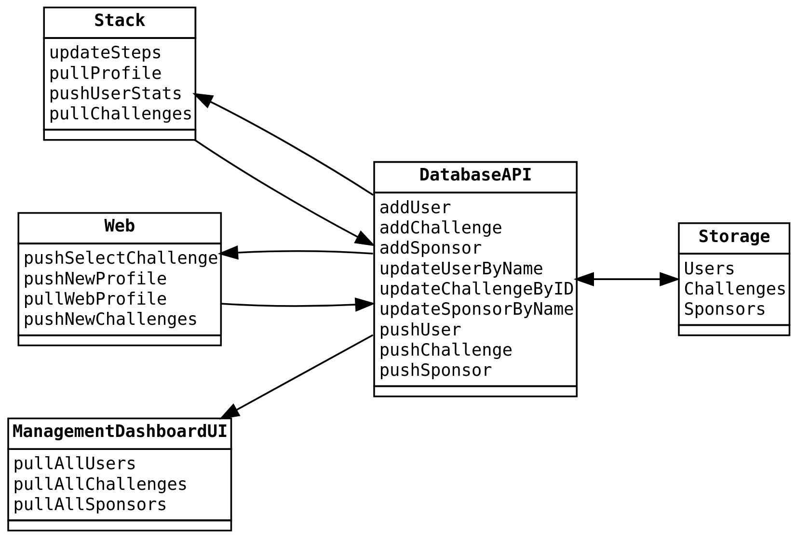

## <a name="oop"></a>b. Object-Oriented design of key sub-systems (e.g. Desktop Application, Web Application etc.)
Our [initial UML diagram](Images/first_uml.png) from one of our initial meetings was limited, however over time, additional key features were added into the following UML diagrams for each of the three sub-systems. 

### <a name="oop-dekstop"></a>DESKTOP
Key classes for desktop app include:

* **data** - database API that retrieves and updates user, sponsor, challenge information (with each data type having their separate APIs respectively to ensure further encapsulation).
* **events** - receives and processes MQTT payloads, passes on information into view to rebuild UI with every new request, and into the database API to either publish (pull type requests) information into MQTT client topics or update (push type requests) the database. This class additionally contained event listeners for buttons and lists in the UI.
* **tests** - the test class contains unit tests to ensure edge cases are handled gracefully.
* **view** - this class deals with data visualisation from parsed user.json, challenge.json and sponsor.json. Contains helped functions for building the UI, for building expanded lists and building charts using local JSON files obtained by requesting data from the respective APIs.


### <a name="oop-web"></a>WEB

For more detail on web technologies see section **1g.** below.
React is ideal to implement object oriented design. Our website consists of functional components (classes - one for each site/view) and an MQTT class which is integrated into the different views.

* **MQTT Class:** This class handles all communication with our "server" and the associated rendering. You will find a call for the MQTT class in all the following components. The class:

  * encapsulates - it hides the detail of the server communication from the other components
  * acts abstract - with a simple interface that can be called by all components
  * inherits its basic methods from the react components
  * is polymorphic - it can handle all sorts of data: from profile to challenge data  
* **Landing Page:** Contains all the static content and the MQTT instance for creating a new profile
* **Login Page:** Contains the static UI + a MQTT instance to handle the Login
* **Profile Page:** Contains a MQTT instance which renders the full profile incl. a dynamic profile picture and  the challenges the user has signed up for
* **Challenge Choice Page:** Contains a MQTT instance which lets the user sign up for challenges
* **Common static components such as headers, navbars or footers** which can be integrated in all of the views


### <a name="oop-m5"></a>M5

#### **Back-End**
Since our M5Stack is effectively a stateless machine with well-developed animations, our back-end Classes are straight-forward.
We need to read in the data from the Gyroscope and use it to detect when the user takes a step. By counting steps we get an idea of how active a user is at any given time. 
We need to send and receive the JSON messages that we agreed on in our shared contract. This allows the M5Stack to be a memoryless machine by pulling and pushing all the necessary data from and to the Desktop server.

* **Pedometer.h**
  * Count the steps taken by the user using the Gyroscope inside the M5Stack. (This code is taken from MPU9250 Basic Example Code by Kris, Modified by Brent Wilkins July 19, 2016).

* **Main.h**
  * This is the main class whose loop() is running at all times in the M5Stack. It publishes and reads messages on the appropriate MQTT Topics, it does so by serializing and deserializing JSON messages using the ArduinoJson.h library.
  Once a JSON message is deserialized it is placed in the correct Class, so for example Challenges data will be stored in the ChallengesView object, whereas Statistics data will be stored in the StatsView object.
  Once all data is correctly handled, Main.h selects which of the Front-End View objects to draw(), according to the screen requested by the user, through the use of the M5Stack buttons. 

#### **Front-End** 
Initally our idea for the M5Stack Front-End Classes was to have a central abstract class View which would execute all of the printing and drawing to screen. We quickly discovered that things like abstract classes, inheritance and polimorphism were too hard to implement effectively in Arduino so the 'View' abstract class does not actually exist in our code. However it is still useful to conceptualize our View classes as belonging to a figurative abstract class since they have the same methods and attributes.


* **View.h (ChallengesView.h, StatsView.h)**
  * Draw the Home screen, Challenges screen or Statistics screen using a composition of their child module Classes (TextBox.h,  Timer.h, Bar.h, Bean.h). These are effectively aggreate classes which combine the move() and draw() functions of our component classes below

* **TextBox.h**
  * Draw a simple box with given text at the bottom of the screen, used to explain what each M5Stack button does in each View

* **Timer.h**
  * Small class implementing a simple timer, we use this in each View class to control the refresh rate of our front-end frames. We also use it in Main.h to set how often we update the user information by sending a user_profile type request to the Desktop Server.

* **Bar.h**
  * Draw a simple horizontal progress bar, used to visualize the "Health" left in the Home view, the progress of a challenge in the Challenges view, and how close a user is to their personal record in the Statistics View. We ended up using a lot of progress bar in our View objects because the M5Stack graphics library provides a simple way to create such progress bars and this kind of bars communicates really well to the user how well or poorly they are performing

* **Bean.h**
  * Used in Home view to draw our main animation: a cute-looking sprite which jumps around the screen and changes it's facial expressions. The movement speed, jumping height and jumping frequency are all dynamically calculated based on the "Health" of the sprite. We spent a lot of time optimizing this class' animations because they are what's meant to keep the user attached to their bean and therefore motivated to live a healthy lifestile.

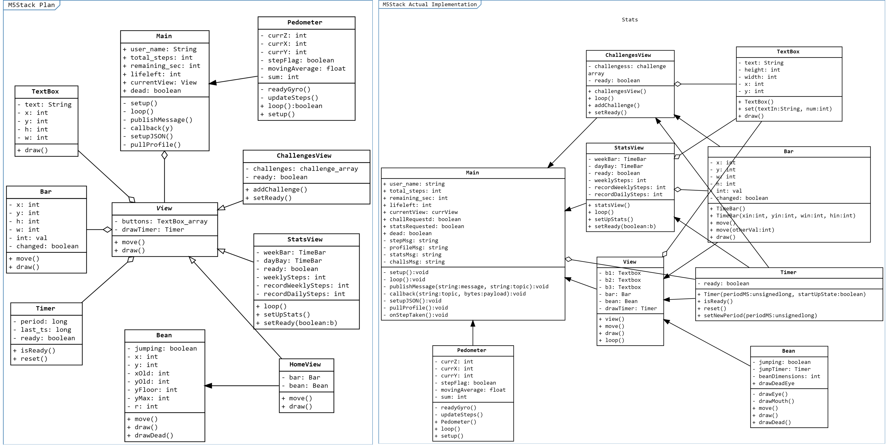
On the left we show what our plan was for our M5Stack design, on the right we show what the end product actually ended up looking like. Clearly Arduino is not the best for Object Oriented Design...


## <a name="reqsubsystem"></a>c. Requirements of key sub-systems (in the form of selected user stories)
We ensured that our product had a user-focused framework by developing three key user stories: **End-User, Admin, and Sponsor**. These three user stories defined our test cases and requirements and were the basis for our development effort.

<p align="center"><b> END-USER:</b> Our first user story is the end-user, who walks around with the M5Stack on his arm, which counts his steps, and displays the health bar of the Bean. The health bar is reflective of how much time the user has left, in order to view the specific time remaining they have to use the web. The user can also use the web to enroll in challenges set by sponsors, and view their total steps. As a reward for successfully completing challenges, they end-user will receive extra time added to their account. </p> 

<p align="center"><b> ADMIN:</b> Our second user story is the admin, who can utilise the management dashboard to to track the userbase. They are able to track statistics of the user, sponsors, and challenges in order to ensure the success of the product and see how others are interacting with the product. If an individual user has an issue, they are able to use the management dashboard to view their profile. Using the management dashboard, they are able to monitor and visualize the data in a user friendly way. </p>

<p align="center"><b> SPONSOR:</b>Finally, our third user story is the sponsor. The sponsor uses the website to create a profile, and then set challenges for the average user to enrol them. They are able to use these challenges as a way to promote their business and brand.</p> 

These key stories were developped in to further user stories, which can be seen in our [Gantt chart](https://uob-my.sharepoint.com/:x:/g/personal/ac16888_bristol_ac_uk/EXltfbLEnNFLrGLOGOxgZcIB2oqj_ft_TP9LevpsozfhVg?e=TUTMn7). However, the main ones can be seen in this use case diagram:

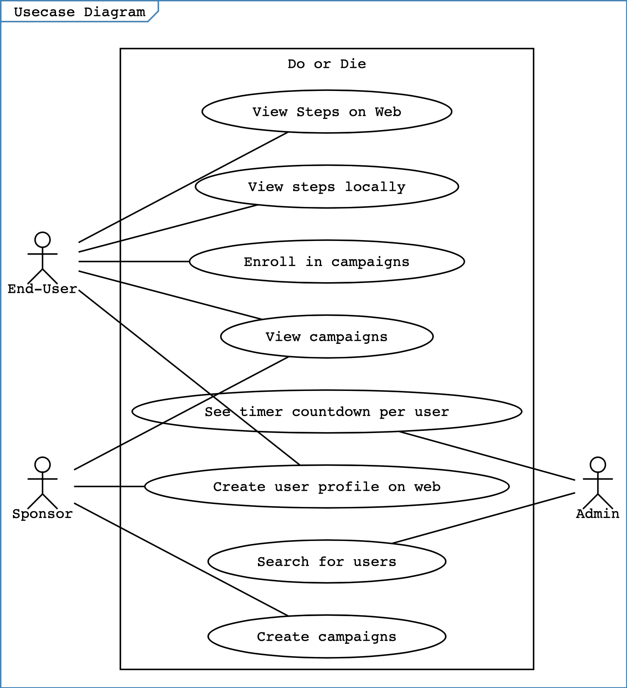

<p align="center"><b>After developing the three user stories, we translated them into the following requirements for our sub-systems:</b></p>

### DESKTOP
Administration interface for data visualisation. Allows back-end to deal with sending and receiving requests, and front-end to track total users, sponsors and challenges currently available.

**Data visualisation UI**
* Front-end needs to pull flat totals from database for current users, sponsors, and available current challenges.
* The interface must be able to split this quantative data based on a time frame, showing changes over daily, weekly and monthly periods.
* We want to be able to look at statistics for any specific user, such as how much time they have left and global steps taken.
* We want to follow thematic colour scheme for the UI.

**Data processing back-end**
* System must be capable of processing JSON requests from both the web application and the M5Stack, and should be able to insert new users, sponsors and challenges into central database, while retaining this data in a persistent manner. 
* System must be able to listen on the correct MQTT client topic for step updates for each user, and update records accordingly.
* System also calculates the life time remaining for each user's avatar based on step updates and time elapsed.
* System should automatically add rewards if user has met required goals in any challenges enrolled.

### WEB

Primary interface for the sponsor and the user to handle everything related to challenges and their profile.

**User**
  * Login: The website must be able to retain the username upon creation/login and in case of a sign-up send the new profile information to the server 
  * Profile: The website must send a request to the server for the user profile and and all his challenge and render that information
  * Render a profile picture depending on the user name (the profile picture will be available on the webserver)
  * Enroll in Challenges: The website must request all challenges from the server, render all of them (dynamically) and inform the server if a user has selected a challenge
  * The information requested and rendered under point i.a) must be updated regurarely (i.e. send a new request to the server every second and render the updated data on the screen)
  
**Sponsor**
  * The website must have an input form for new challenges that the sponser can fill in. The input of the sponser gets validated (e.g. did he complete all fields). Upon submission the new challenge will be sent to the server
  
### M5 
When designing the interface of the M5Stack, we were mainly focused on the End-User story. Thus, the requirements for the End-User were our main focus. In order to ensure that we satisfied these, we split our requirements into two further subheadings.

**Back-End**
* The M5 must have a pedometer, able to accurately count the end-user's steps, and store them locally. 
* The M5 must be able to communicate with the server using the shared communication contract.

**Front-End**
* To ensure customer retention, we have to implement an enganging and appealing interface. 
* The M5 should display a live step count. 
* The M5 should display an adorable sprite (called Bean) to create an attachment with the end-user, and ensure long-term engagement. 
* The M5 must have a health bar which accurately reflects how much time Bean has left. 
* Bean's animations and general liveliness should reflect its remaining life (i.e. it should bounce less when it is closer to death).
* The M5 should display the challenges that the user is enrolled in. 
* The M5 should display the user's statistics. 


## <a name="uiwireframe"></a>d. The evolution of UI wireframes for key sub-systems
Our [User Story video](Images/paper_prototype_video.mp4), developed during the prototype phase, demonstrates our initial design for our product. How this changed for each subsystem will be considered in this section. 

### DESKTOP
Original multi-tab wireframe design for desktop UI:
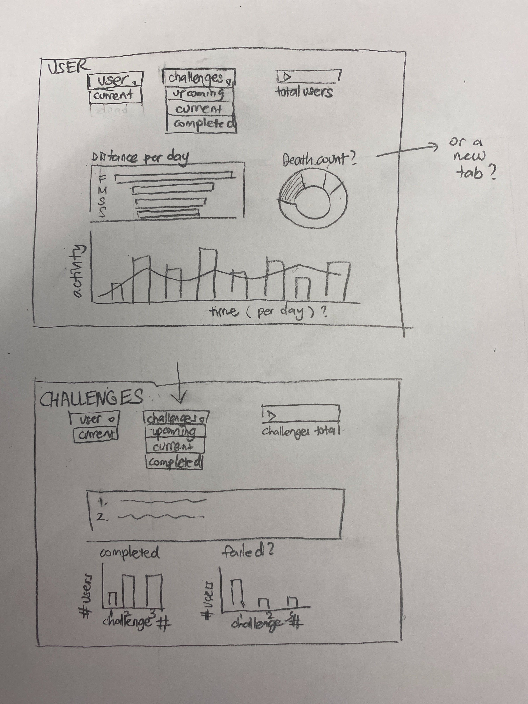

Updated wireframe design for UI in a single window:
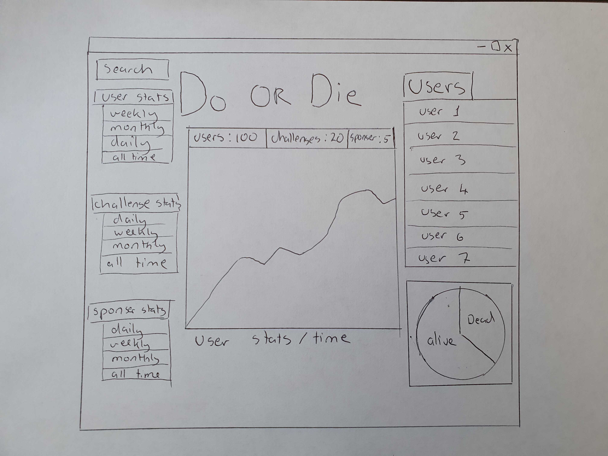

Final decided layout for admin UI:
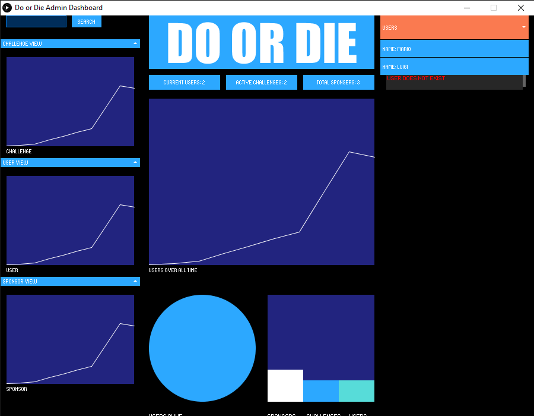

Pulling up a user profile by either using the search bar or dropdown list, an error message to show if a user does not exist:
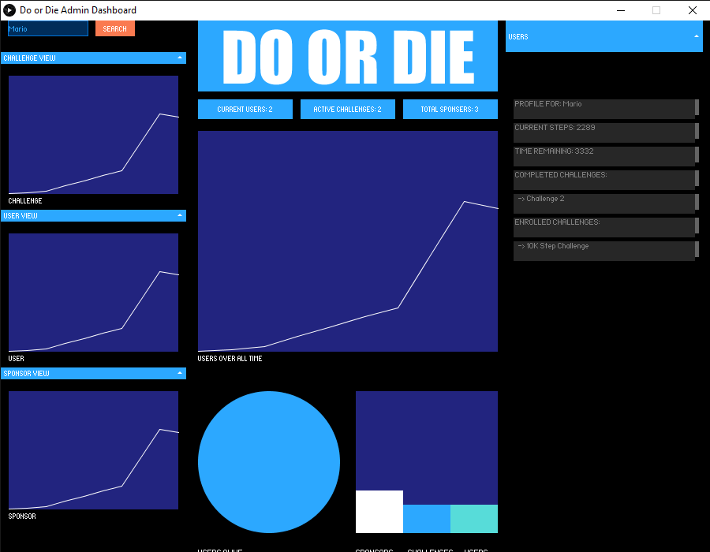 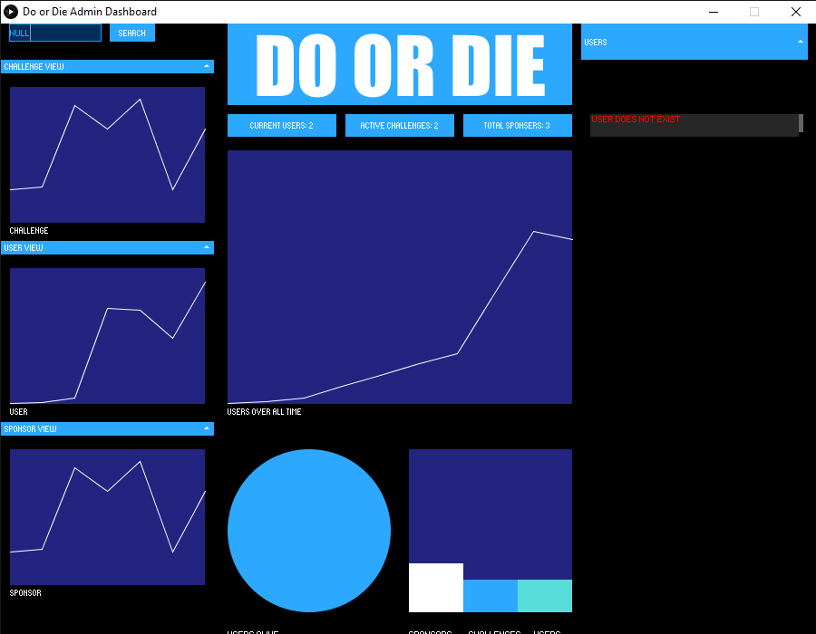

Selecting a specific statistic from UI:


Different selected charts showing data for each parameter, such as users, sponsors, challenges.
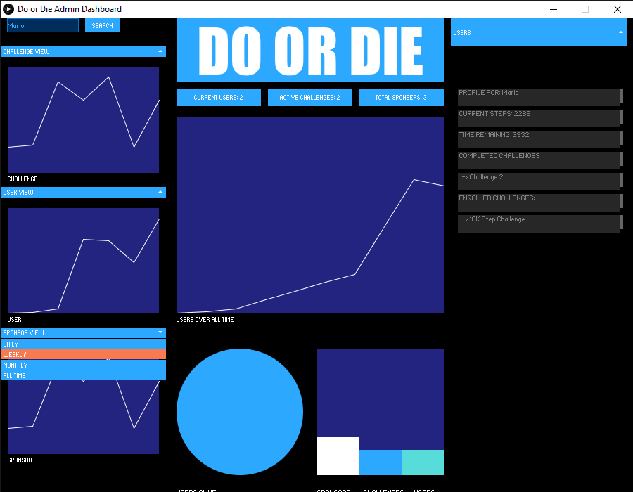

### WEB

Original web wireframe design for desktop profile:


Simplified but dynamic profile page, user can choose from several profile pictures, steps, time and ranking get updated once per second.
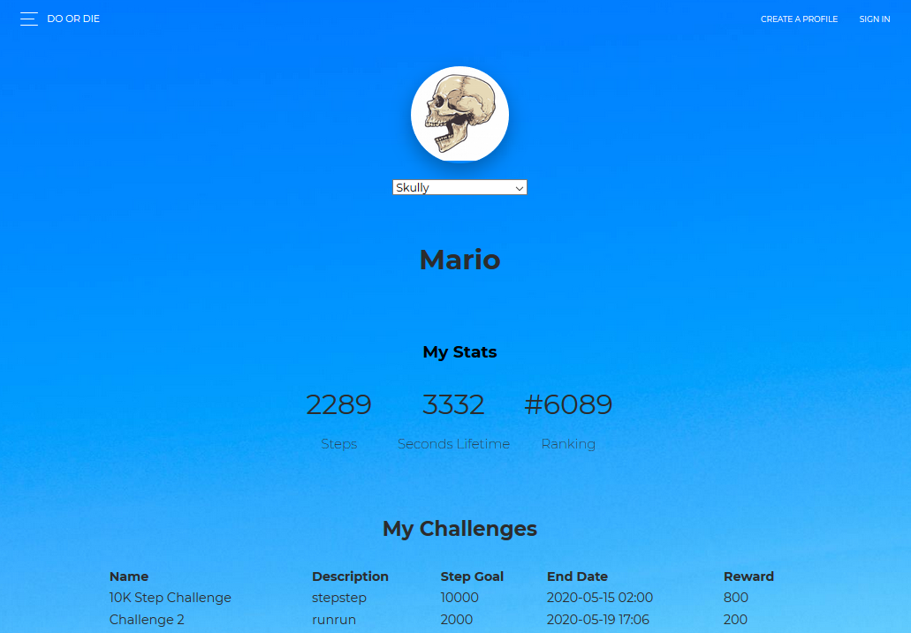

Sign-up screen draft
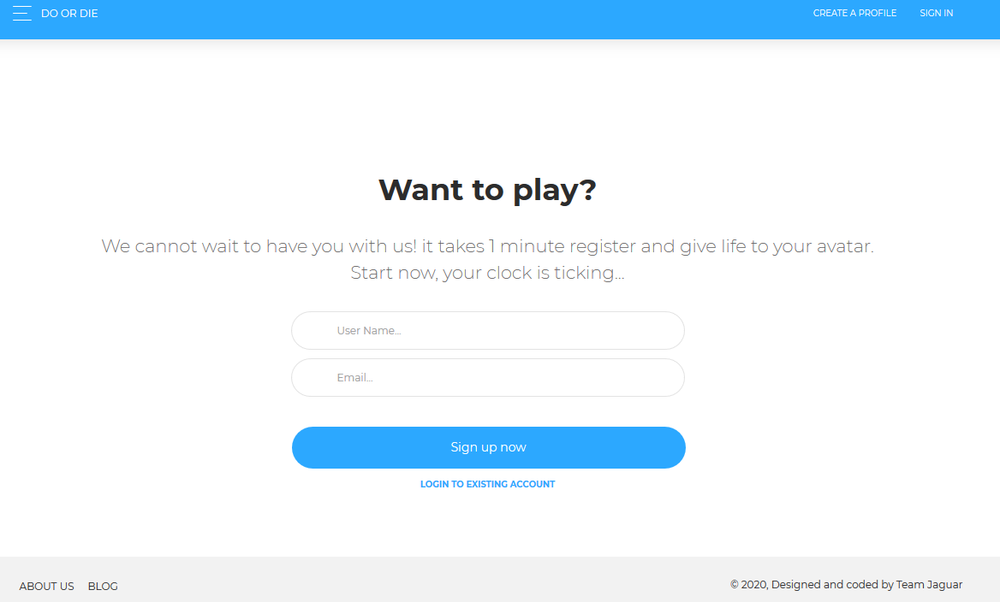

Final sign-up screen, with the sponsor checkbox. Sponsors will be forwarded to the create challanges page, users to their profile page.


### M5
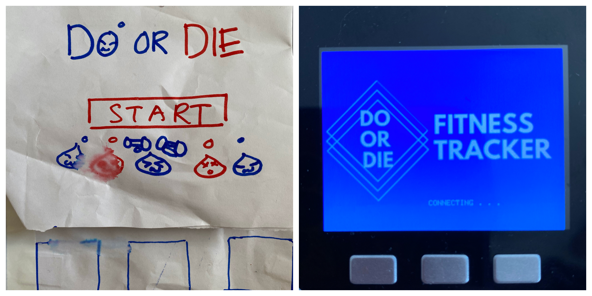

The starting screen was replaced with a more professional logo, following user feedback.


From the initial UI wireframe, we designed and animated a simple but responsive sprite. The screen was decluttered to allow the focus on the sprite, based upon feedback we received during the user testing session. 


The stats screen was implemented according to the UI wireframe, however we have not implemented the sleep detection feature due to its dificulty to develop. Therefore, different statistics have been displayed. 


Initially our UI wireframe included a shop feature, however after adding a third user type (the Sponsor) we shifted our focus to implementing the challenges feature instead. The shop feature remains a valid possible future feature as dicussed in [Project Evaluation](ProjectEvaluation.md). 

## <a name="commprotocol"></a>e. Details of the communication protocols in use (including a rational for your choice)
Our Internet of Things product was developed utilising the M5Stack platform. Due to the use of this platform, we utilised WiFi connectivity to allow for communication between our subsystems. This allowed for data to move between web to desktop, M5Stack to desktop and desktop to both the Web and M5Stack. Further, we used MQTT(Message Queue Telemetry Tansport) as our communication protocol rather than something like HTTP web services. We made this decision for a few reasons: 

* As HTTP is a synchronous protocol, the client is required to wait for the server to respond. On the other hand, with MQTT the client connects to the broker and subscribes to the message "topic" in the broker. The MQTT is able to receive all messages from the clients and route the messages to the relevant clients. This allows for us to communication across subsystems at the same time. 

* HTTP is a one-way connection, this means that the client (ie. our M5Stack) is not able to passively receive messags from the server. By utilising the MQTT protocol, the client can subscribe to the topic and receive all messages. This allows for real-time updated data. 

* MQTT allows for scalability of our product, when there are a number of devices connected across the platform. This is due to the fact that it utilises reduced network bandwith to move the data between subsystems, which would then lower operation costs. 

* MQTT has become the standard for IoT communication, due to its flexibility and efficiency which made it an easy choice. Due to the fact that responses are received virtually instantaneously, it is the ideal choice to send data such as the user's live health bar (this is particularly useful in accurately showing when the user's Bean "dies"). 

To implement the MQTT communication protocol in our IoT product, we used [HiveMQ](https://www.hivemq.com). Our team established two topics, 'doordie_web' and 'doordie_steps'. Only one request type uses 'doordie_steps', which is detailed below.

Due to variability of payload attributes and sizes (especially concerning challenges), we made the decision to make a unifying request "type" parameter. For almost all request types, we chose to include a "user" parameter. Together, these two parameters allow our subsystems to ignore all messages in that topic unless there is an exact match. A list of all valid request types made between devices is found in [MQTT_request_types.txt](/Documentation/Mqtt_request_types.txt), this document was used by our group to ensure clear communication between subsystems. We will expand on the key communication protocols and the request types below. 

### <a name="comm-desktop-m5"></a>DESKTOP AND M5STACK 
To send a user's profile data to the M5Stack from the database:
``` 
{
    	"type": "push profile",
    	"user_name": "Mario",
    	"total_steps": 2200,
    	"remaining_sec": 2000
}
```
This is only sent when M5 sends a request to the MQTT broker:
```
{
    	"type": "pull profile",
    	"user_name": "Mario"
}
```

Processing sends all challenges a user is enrolled in to be updated on their M5Stack:
```
{
    "type": "push user challenges",
    "user_name": "Mario",
    "challenges": [
    {
        "challenge_id": "1",
        "challenge_name": "10K Step Challenge",
        "description": "stepstep",
        "end_time": 1589500800,				
        "step_goal": 10000,
        "reward": 800
    },
  
    {
        "challenge_id": "2",
        "challenge_name": "Challenge 2",
        "description": "runrun",
        "end_time": 1589500800,
        "step_goal": 2000,
        "reward": 200
    }]
}
```

This is sent when the M5Stack requests the challenges of the user: 
```
{
   	"type": "pull user challenges",
	"user_name": "Mario"
}
```

To update the statistics of the user on the M5Stack: 

```
{
	"type": "pull user stats",
	"user_name": "Mario"
}
```

The database uses the following request type to send stats to the M5Stack: 
```
{
	"type": "push user stats",
	"user_name": "Mario",
	"daily_record": 10000,
	"weekly_record": 39000,
	"weekly_current": 18032
}
```

The M5Stack uses this request type to increment one step in the database, but there will be no response from the database. It is only for this request type that the 'doordie_steps' topic is used, as we expect steps to be sent every second. This allows for scalability of our product as the number of users increases: 

```
{
   	 "type": "push step",
    	 "user_name": "Mario"
}
```

### <a name="comm-desktop-web"></a>DESKTOP AND WEB
When the web pushes a new profile to the database, there is no response from the database:
```
{	
	"type":"push new profile",
	"user_name":"Mario",
	"user_type":"sponsor",
	"joined_date":1587980814845
}

```

The web requests a user profile from the database: 
```
{
    "type": "pull web profile",
    "user_name": "Mario"       
}
```

The database uses the same request type as it does for the M5Stack to send a user profile:
```
{
    "type": "push web profile",
    "user_name": "Mario",
    "total_steps": "2200",
    "remaining_sec": "2000",
    "challenges": [
    {
        "challenge_id": "1",
        "challenge_name": "10K Step Challenge",
        "description": "stepstep",
        "end_time": 1589500800,				
        "step_goal": 10000,
        "reward": 800
    },
  
    {
        "challenge_id": "2",
        "challenge_name": "Challenge 2",
        "description": "runrun",
        "end_time": 1589500800,
        "step_goal": 2000,
        "reward": 200
    }]
}
```

The web requests all challenges that the user is enrolled in with:
```
{
    "type": "pull user challenges",
    "user_name": "Mario"
}
```

The database responds with the same request type used for the M5Stack to send all challenges an individual user is enrolled in:
```
{
    "type": "push user challenges",
    "user_name": "Mario",
    "challenges": [
    {
        "challenge_id": "1",
        "challenge_name": "10K Step Challenge",
        "description": "stepstep",
        "end_time": 1589500800,				
        "step_goal": 10000,
        "reward": 800
    },
  
    {
        "challenge_id": "2",
        "challenge_name": "Challenge 2",
        "description": "runrun",
        "end_time": 1589500800,
        "step_goal": 2000,
        "reward": 200
    }]
}
```

The web requests all challenges:
```
{
    "type": "pull all challenges"
}
```

The database sends all current challenges to the web: 
```
{
    "type": "push all challenges",
    "challenge": [
    {
        "challenge_id": "1",
        "challenge_name": "10K Step Challenge",
        "description": "stepstep",
        "end_time": 1589500800,				
        "step_goal": 10000,
        "reward": 800
    },
  
    {
        "challenge_id": "2",
        "challenge_name": "Challenge 2",
        "description": "runrun",
        "end_time": 1589500800,
        "step_goal": 2000,
        "reward": 200
    }]
}
```

When a sponsor adds new challenges, there is no response from the database:
```
{
    "type": "push new challenge",
    "challenge_id": "3",
    "challenge_name": "Challenge 2",
    "description": "runrun",
    "end_time": 1589500800,
    "step_goal": 2000,
    "reward": 200
}
```

When the user selects a challenge, there is no response from the database:
```
{
    "type": "push select challenge",
    "user_name": "Mario",
    "challenge_id": "1"
}
```

## <a name="data"></a>f. Details of the data persistence mechanisms in use (including a rational for your choice)

Each user, challenge and sponsor is stored as a JSON object to allow for easy parsing and sending of payloads. In order to allow persistence we used users.json, sponsors.json and challenges.json files to store respective data. This format allows the central server to send an entire user profile when recieving a request from the M5 or web device to pull a profile using the data API. Each user object contains a challenges_id array which contains all the ids of currently enrolled challenges. Challenge_id array parameter is used to refer to enrolled challenges from challenges.json in order to keep payload lengths below the MQTT maximum. Similarly, each sponsor object also contains a challenge_id array (foreign key that refers to challenges data). This structure would ideally be implemented in a SQL relational database to increase speed and maintanability. 

M5 device is stateless therefore does not store information locally apart from created variables such as the username, which is required to pull data from the database when the M5 first starts up. These are then pulled from the database via a pull user profile request type. 


## <a name="webtech"></a>g. Details of web technologies in use (including a rational for your choice)
Our website is react based and built on top of a simple react/bootstrap template.
The choice for these technologies was driven by some key needs of our website/team that ultimately led us to choose this set up:
1. **Ability for integration of MQTT commuication protocol:** When looking into the different framework we realized that the script Tom provided us for the MQTT communication could be easily reused and integrated into all major Javascript based frameworks (e.g. Angular, React, Vue).
2. **Ability to dynamicially refresh content on a regular basis in an easy way:** React turned out to be the obvious candidate to satisfy this need: Its logic is centered around an app state, with components getting rerendered every time the state changes. That way we could display a dynamic step / lifetime counter which would change in real time without refreshing the page.
3. **Availability of UI templates for rapid but beautiful prototyping:** React is currently [the most widely used](https://hotframeworks.com/) web framework, so there were plenty of templates available. We chose a [free template by Creative Tim](https://demos.creative-tim.com/now-ui-kit/index.html), which included some basic UI components such as a navigation and a profile page and would allow us to build rapid prototypes without bothering about the details of styling and navigation.
4. **Support for Object Oriented Design:** To support our object oriented design we were looking for a framework that supports the use of a strong object oriented design. React components are ideal to build class based software (see chapter 1.b).
5. **The MQTTclient Class:** Every page needs to be able to send or receive json messages, usually both, to and from the MQTT broker, so we have implemented an MQTT class which handles all data to prevent repetition in the design of each page. As the incoming json messages over the broker for the web profile are the most flexible in nature out of all pages, the MQTT class has conditional rendering dependent on the internal state of the class. The MQTT class running on a given system listens to incoming messages based on the username so if another user is accessing the site from elsewhere, there is no mismatch of data between the sessions and each user won't interrupt the others navigating the website. This was designed in order to be scalable, and to ensure the client continues to listen to the broker until the correct packet of information has been received, which is parsed and interpreted.

